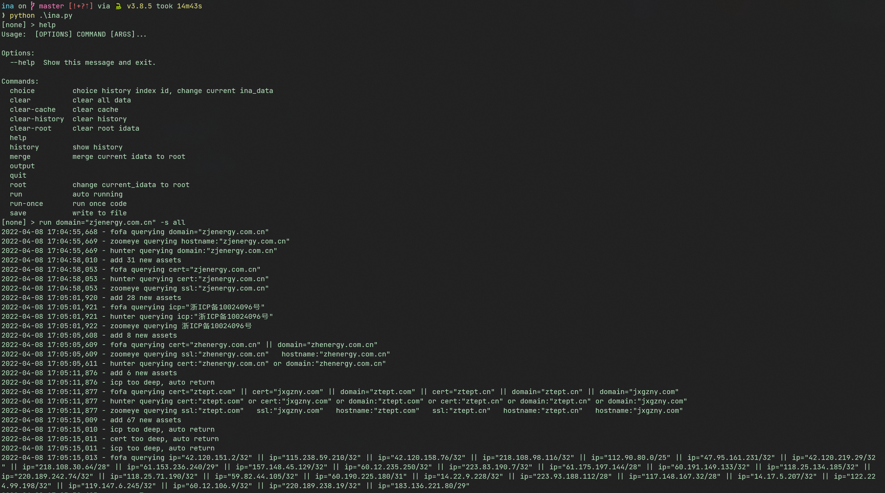
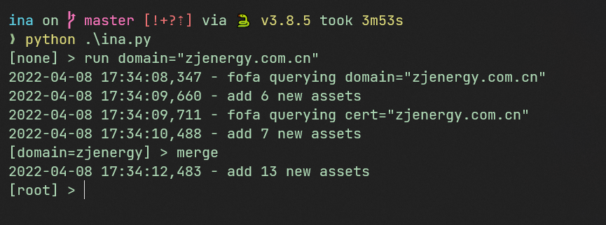
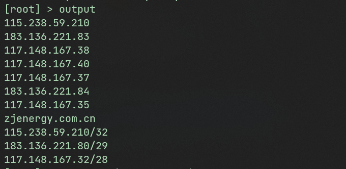
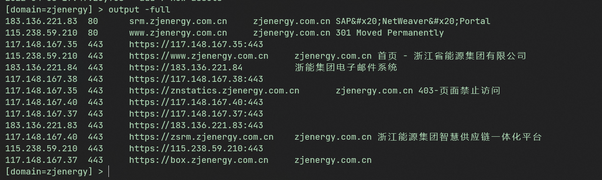

# Ina

空间搜索引擎递归爬虫, 能自动交叉递归爬取多个搜索引擎的数据.

与其兄弟Ani(子公司递归爬虫)相辅相成

## install
下载项目代码

`git clone https://github.com/ZTeam-H3/Ina`

需要python3.8及以上

安装依赖

`pip install -r requirements.txt`

## Usage
默认采用的是fofa的查询语法, 会自动转换成通用查询语言.

python ina.py

**自动递归爬取:**
run domain="zjenergy.com.cn"

因为zoomeye与hunter限制次数的问题, 默认使用的搜索引擎为fofa. 可以使用`--source all`指定全部 或 `--source zoomeye,fofa`指定特定搜索引擎

这里还有个-cidr参数, 会在递归结束后整理网段, 收集网段内的所有数据, 但是可能误报率略高, 所以默认关闭, 可以使用-cidr开启

**单次查询:**

默认多引擎查询

run-once domain="zjenergy.com.cn"

**context 上下文**
有一个全局上下文root, 可以使用`root`命令切换到root上下文

每次run/run-once命令行, 会自动切换到当前上下文.

在任务结束后, 可以通过`merge`命令是否合并数据,会自动去重

**output**
`output` 命令输出结果到命令行, 默认的输出格式为加特林友好的按行分割数据, 可以直接复制到加特林, 可以通过-field指定字段

`output -full` 为人类友好的数据格式

`output -json` json格式输出

save命令类似, 通过-f输出到文件
